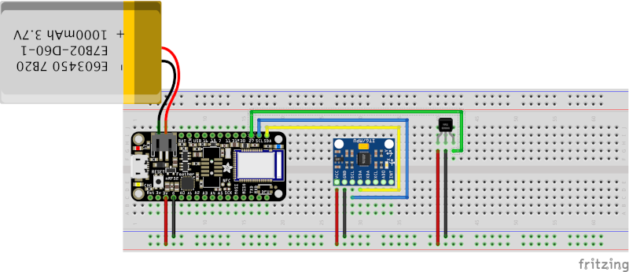
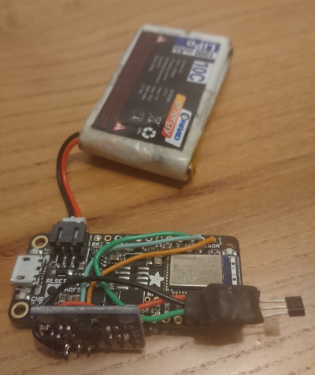
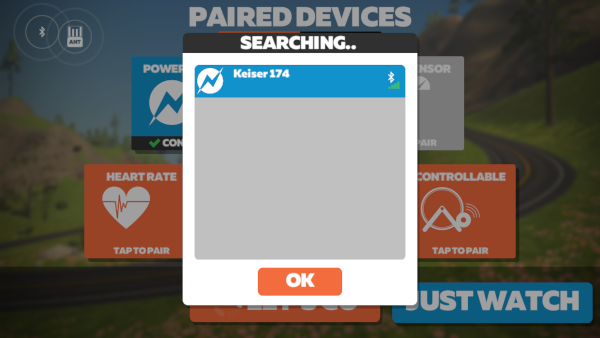

<h3 align="center">BLE Power Meter</h3>

  <p align="center">
    Do you have an exercise bike without bluetooth but would still like to use training platforms like Zwift, Rouvy and Training Peaks? Using the Adafruit Feather nRF52 you can.
    <br />

  </p>
</div>


<!-- TABLE OF CONTENTS -->
<details>
  <summary>Table of Contents</summary>
  <ol>
    <li>
      <a href="#about-the-project">About The Project</a>
    </li>
    <li>
      <a href="#getting-started">Getting Started</a>
      <ul>
        <li><a href="#prerequisites">Bill of Materials</a></li>
        <li><a href="#prerequisites">Wiring</a></li>
        <li><a href="#installation">Installation</a></li>
      </ul>
    </li>
    <li><a href="#license">License</a></li>
  </ol>
</details>


<!-- ABOUT THE PROJECT -->
## About The Project

Most older exercise bikes lack modern bluetooth compatibility but do still have a readout of the power generated. Using the Adafruit Feather you can bridge this gap.

This project was designed for the Keiser M3 exercise bike specifically but could be adapted to various others.

Most older exercise bikes use pedal cadence to calculate the power which appears on the head unit. To keep it compact and the design below uses a hall effect sensor and a magnet on the pedal arm to calculate cadence but you could modify the bikes cadence sensor directly as an alternative.

It also uses an MPU6050 on the gear selector to detect changes and adjust the power output. Once calibrated it can be adjusted to replicate the changes in power seen on the exercise bike head unit.

<p align="right">(<a href="#top">back to top</a>)</p>


<!-- GETTING STARTED -->
## Getting Started


### Bill of Materials

* An [Adafruit Feather nRF52](https://www.adafruit.com/product/3406)
* MPU6050
* A low voltage unipolar hall effect sensor
* Lipo battery (optional)

### Wiring

Components are wired as follows.



This can be soldered compactly as follows. **Notice the horizontal orientation of the MPU6050.**



And temporarily mounted of the Keiser M3 with MPU6050 at the top.


### Installation

1. Follow the instructions on the Adafruit site to connect the nRF52832 to Arduino IDE. [https://learn.adafruit.com/bluefruit-nrf52-feather-learning-guide](https://learn.adafruit.com/bluefruit-nrf52-feather-learning-guide)

2. Clone the repo
   ```sh
   git clone https://github.com/jonnyfishman/Keiser-BLE-Power-Meter.git
   ```
4. Open `BLE_Power/BLE_Power.ino` in the Arduino IDE (if you move the main `.ino` file make sure that all the included `.cpp` and `.h` files are in the same directory)

5. Edit the code if needed.

By default debugging is disabled. To enable it remove the comments from the start of the file.
```ide
//#define DEBUG  
    BECOMES
#define DEBUG  
```

**Optionally adjust.**
```ide
#define CALIBRATE_WAIT_MS   3000          // How long the sensor will initially wait for the low and high set points
#define HALL_EFFECT_SENSOR  27            // Where the hall effect sensor sense pin is connected
#define LED_PIN             LED_RED       // For visual reference using the onboard LED
#define TIMING_ERROR        10            // For the state engine timing. Increase data does not seem to be arriving
```

6. Flash the code to your board.

7. Connect to the training platform of your choice. When powered the device should show up as a power source.




<p align="right">(<a href="#top">back to top</a>)</p>


## Roadmap

<ul>
  <li>Add CCCD callback for custom settings to detect if sending is required</li>
  <li>Update app and publish</li>
</ul>

<!-- LICENSE -->
## License

Distributed under the MIT License. See `LICENSE.txt` for more information.

<p align="right">(<a href="#top">back to top</a>)</p>
